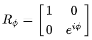

# MultiQubit simulator

This repo can be used to simulate a MultiQubit system with a JSON file. 
The are a few different ways you can use this MultiQubit simulation, which are explained below.

## Installation
The code in this repo requires for python and the numpy library to be installed on your computer. Python can be downloaded [here](https://www.python.org/downloads/release/python-370/) and numpy can then be installed with the cmd command `pip install numpy`

## Generate your JSON
Firstly, if JSON is still a bit difficult for you to understand, you can use the makeMulti.html file to generate your own JSON.
You will be able to copy this JSON file to the multi.json file and run the multiJSONParser.py file. The pyton file will automaticly run the generated JSON file and print its outcome to screen.

## Make your own JSON
Secondly, you could also make your own JSON file, which will be faster to correct or add small things. After this the process of generating your output will be exectly the same as the first explained method. After you put your JSON in the multi.json file, just run multiJSONParser.py and your output will be displayed.


## JSON file explanation
Below follows an explanation of all the different parameters in the JSON file. The standard format of the JSON looks like this:

```JSON
{
	"multi": [
		{
			"qubits" : [],
			"paulix" : [],
			"pauliy" : [],
			"pauliz" : [],
			"hadamard" : [],
			"sqrnot" : [],
			"rphi" : {
				"index" : [],
				"phi" : 1
			},
			"print" : "false"
		}
	]
}
```

All the different paramaters can be erased except for "qubits" because otherwise you won't even have Qubits in your MultiQubit system.
Below I will go along every paramater and explain how to input values in there for your MultiQubit system.

# qubits

In here the Qubits in the program are specified. Below follows an example with all the different options which will be explained after:

```JSON
{
    "multi": [
		{
            "qubits" : [[1,0], ["HS2", "HS2"], ["1j", "0j"], []]
        }
    ]
}
```
<ul>
    <li> Regular integers can be put in as integers.
    <li> 1 divided by the square root of 2 can also be used as HS2, with quotes.
    <li> Complex numbers can also be put in using quotes.
    <li> Giving qubits an array without Qubit values will result in an random Qubit.
</ul>

# paulix / pauliy / pauliz / hadamard / sqrtnot

With these parameters you can specify on what Qubit or Qubits you want to apply a logic gate. For the example I will use paulix, but the other gates work exactly the same. The index of the Qubits will of course start at 0.

```JSON
{
    "multi": [
		{
            "qubits" : [[1,0], ["HS2", "HS2"], ["1j", "0j"], []],
            "paulix" : [0,2]
        }
    ]
}
```

In this example the paulix logic gate will be applied to index 0 and 2 of the multiQubit system. So the first and the third Qubit will change.

# rphi

This gate works a bit different then the other gates. For this gate the indices also needs to be specified, but it also asks for an extra parameter. First PI will be divided by this number that is given. After that this variable, specified as PHI will be put into the matrix which is displayed below:



```JSON
{
    "multi": [
		{
            "qubits" : [[1,0], ["HS2", "HS2"], ["1j", "0j"], []],
            "rphi" : {
				"index" : [0,1],
				"phi" : 1
			}
        }
    ]
}
```

# print

For debugging and visual usage a print parameter is also included. If print is not present it will automaticly be set to false.
Below is an example for the print parameter usage:


```JSON
{
    "multi": [
		{
            "qubits" : [[1,0],[0,1]],
            "print" : "true"
        }
    ]
}
```

Below follows the output of this JSON file in the cmd:

```cmd
    Your start matrix looks like this:

    [
    1|0> + 0|1>
    0|0> + 1|1>
    ]


    The outcome of multiQubit 0 is: 01


    After reading your matrix looks like this:

    [
    1|0> + 0|1>
    0|0> + 1|1>
    ]
```

Without print enabled i will look like this:

```cmd
    The outcome of multiQubit 0 is: 01
````

# read

This isn't a parameter but after applying all the gates to the MultiQubit system, it will automaticly read the qubits and print the outcome to the cmd. 

